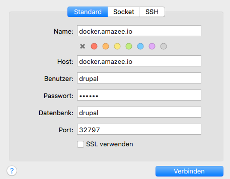

!!! warning
    This section is outdated and needs an update

# Connect to MySQL in Docker Container

If you like to connect to the MySQL Database inside the Docker container with an external Tool like [Sequel Pro](http://www.sequelpro.com/), [MySQL Workbench](http://www.mysql.com/products/workbench/), [HeidiSQL](http://www.heidisql.com/), [DBeaver](http://dbeaver.jkiss.org/), just plain old `mysql` cli or anything else.

### Get published mysql port from container

Docker assigns a randomly published port for MySQL during each container start. This is done to prevent port collisions.

To get the published port via `docker`:

    $ docker port changeme.net.docker.amazee.io
    3306/tcp -> 0.0.0.0:32797

Or via `docker-compose` inside a Drupal repository

    $ docker-compose port drupal 3306
    0.0.0.0:32797

### `linux` Get ip from container

If you are on Linux and run docker natively, you also need to get the IP of the container

    $ docker inspect --format '{{ .NetworkSettings.IPAddress }}' changeme.net.docker.amazee.io
    172.17.0.4

### Connect to MySQL

|          | Linux                         | OS X                          |
|----------|-------------------------------|-------------------------------|
| IP/Host  | ip from container             | `docker.amazee.io`            |
| Port     | published port from container | published port from container |
| Username | `drupal`                      | `drupal`                      |
| Password | `drupal`                      | `drupal`                      |
| Database | `drupal`                      | `drupal`                      |

#### Example Sequel PRO

